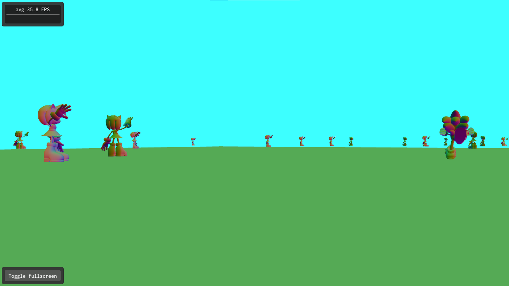

# cg_projeto2 - Sonic Test

Atividade desenvolvida para a disciplina de computação Gráfica da UFABC - ministrada pelos docentes Bruno Augusto e Harlen Batagelo.

## Como foi feito

Para esta atividade foi proposto o desenvolvimento de uma aplicação gráfica 3D. Foi pensado em desenvolver um jogo 

Endless Runner (do tipo Subway Surfers), mas utilizando personagens do mundo Sonic com os "obstáculos" sendo os 

amigos do ouriço.
    
A ideia parecia funcionar em teoria, mas na prática ocorreram diversos problemas.

1. Não foi possível detectar a colisão de uma maneira prática entre o Sonic e os outros (foi encontrada uma técnica 
chamada AABB, mas não consegui implementar a tempo da entrega);

2. Os efeitos de visualizações estavam muito estranhos, então foi feita uma tentativa de simplificá-los utilizando 
apenas personagens na origem de y;

3. As cores ficaram destoantes, apesar dos arquivos conseguidos terem uma referência ao conteúdo .mtl, também não 
consegui incluí-los no código a tempo da entrega.

4. O único tipo de colisão detectada que ainda precisa de ajustes é quando o Sonic sai dos limites da tela. Ao ocorrer isso ele é renderizado novamente no centro.

Então para conseguir algo entregável e que dá uma deixa para a próxima atividade é o que está presente neste repositório.

Uma aplicação em que é possível movimentar o Sonic pelo eixo X com as setas direita e esquerda, acelerar e "frear" o personagem com as setas para cima e para baixo (espaço também desacelera o personagem de forma mais rápida) e movimentar a câmera com as teclas 'a' e 'd'. Além de rotacionar o próprio Sonic com o mouse.

As interações podem ser vistas no método handleEvent:

    void OpenGLWindow::handleEvent(SDL_Event& event) {
        // Mouse handler
        glm::ivec2 mousePosition;

        // Keyboard events
        if (event.type == SDL_KEYDOWN) {
            if (event.key.keysym.sym == SDLK_LEFT) {
                m_panSpeed = -1.0f;
            }
            if (event.key.keysym.sym == SDLK_RIGHT) {
                m_panSpeed = 1.0f;
            }
            if (event.key.keysym.sym == SDLK_a) {
                m_truckSpeed = -1.0f;
            }
            if (event.key.keysym.sym == SDLK_d) {
                m_truckSpeed = 1.0f;
            }
            if (event.key.keysym.sym == SDLK_UP && m_dollySpeed < 5.0f) {
                m_dollySpeed += 0.5f;
            }
            if (event.key.keysym.sym == SDLK_DOWN &&  m_dollySpeed > -5.0f) {
                m_dollySpeed -= 0.5f;
            }
            if (event.key.keysym.sym == SDLK_SPACE) {
                m_viewMatrix = 
                    glm::lookAt(glm::vec3(0.0f, 0.0f, 0.0f), glm::vec3(0.0f, 0.0f, -1.0f),
                    glm::vec3(0.0f, 1.0f, 0.0f));
                
                m_dollySpeed -= 1.0f;
            }
        }
        if (event.type == SDL_KEYUP) {
            if (event.key.keysym.sym == SDLK_LEFT && m_panSpeed < 0) {
                m_panSpeed = 0.0f;
            }
            if (event.key.keysym.sym == SDLK_RIGHT && m_panSpeed > 0) {
                m_panSpeed = 0.0f;
            }
            if (event.key.keysym.sym == SDLK_a && m_truckSpeed < 0) {
                m_truckSpeed = 0.0f;
            }
            if (event.key.keysym.sym == SDLK_d && m_truckSpeed > 0) {
                m_truckSpeed = 0.0f;
            }
            if (event.key.keysym.sym == SDLK_UP && m_dollySpeed > 0) {
                m_dollySpeed -= 0.01f;
            }
            if (event.key.keysym.sym == SDLK_DOWN && m_dollySpeed < 0) {
                m_dollySpeed += 0.01f;
            }
            if (event.key.keysym.sym == SDLK_SPACE) {
                m_dollySpeed += 0.01f;
                m_trackBall.mousePress(mousePosition);
                m_trackBall.mouseRelease(mousePosition);
            }
        }

        // Mouse events
        SDL_GetMouseState(&mousePosition.x, &mousePosition.y);

        if (event.type == SDL_MOUSEMOTION) {
            m_trackBall.mouseMove(mousePosition);
        }
        if (event.type == SDL_MOUSEBUTTONDOWN && event.button.button == SDL_BUTTON_LEFT) {
            m_trackBall.mousePress(mousePosition);
        }
        if (event.type == SDL_MOUSEBUTTONUP && event.button.button == SDL_BUTTON_LEFT) {
            m_trackBall.mouseRelease(mousePosition);
        }
        if (event.type == SDL_MOUSEWHEEL) {
            m_zoom += (event.wheel.y > 0 ? 0.5f : -0.5f) / 5.0f;
            m_zoom = glm::clamp(m_zoom, -1.5f, 1.0f);
        }
    }

Note que ao pressionar espaço, vão ser zeradas as rotações e translações do Sonic, como se ele estivesse parando mesmo, 
invés de apenas ir para trás.

Outro detalhe que vale a pena mencionar é que cada parte renderizada na tela, incluindo o chão, são feitas através 
de arquivos .obj retirados do site clara.io onde podem ser encontrados diversos modelos gratuitos para serem utilizados 
em projetos.
 
## Resultado Final

O Resultado final foi uma aplicação simples que possibilita ao usuário "correr" pelo mundo tridimensional quase que 
sem restrições. Como mostrado abaixo.

### Primeira visão

### Movimentando a camera com 'a' e 'd'

### Movendo o Sonic com o mouse e depois com as teclas direcionais 

### Dando zoom para aproximar dos personagens

### Desenvolvido por

Thiago Silva das Mercês RA - 1120181014

### Referências

Modelos 3D obtidos:

Floor by Khai - https://clara.io/view/16d9511b-a328-4cd2-9f24-3053cb14c1f2

Sonic 2 by Superamir1236 - https://clara.io/view/421d0378-8944-4741-a756-c168634dad3f

Sonic Series - Amy Rose by damienboi - https://clara.io/view/c10508d6-eff7-4762-8ff8-23e3cf4b87ce